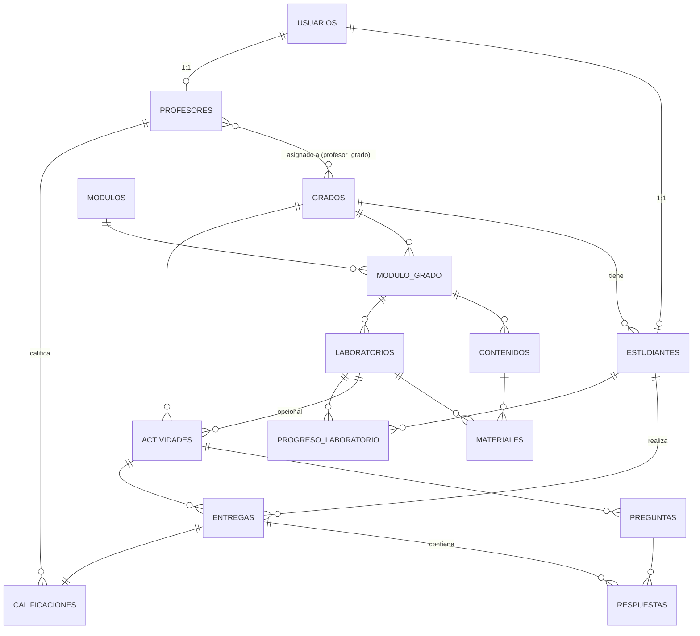

# Laboratorio Virtual de Informática — Arquitectura del Sistema

Plataforma educativa para el área de Informática y Tecnología, grados 8° a 11°.
Documento vivo: se actualizará a medida que avance el desarrollo por módulos.

---

## 1. Arquitectura del sistema

### 1.1 Visión general

```
┌─────────────────────────────────────────────────────────────┐
│                        NAVEGADOR (React SPA)                 │
│  - UI por rol (Admin / Profesor / Estudiante)                 │
│  - Motor de laboratorios interactivos (componentes JS)        │
│  - Vite build → assets estáticos servidos por Nginx           │
└───────────────────────────┬────────────────────────────────┘
                             │ HTTPS / JSON (REST)
┌───────────────────────────▼────────────────────────────────┐
│                 API REST (Django REST Framework)              │
│  - Autenticación JWT (djangorestframework-simplejwt)          │
│  - Permisos por rol y por objeto                              │
│  - Apps: accounts, academics, content, labs, submissions       │
│  - Serializers / ViewSets / Servicios de negocio               │
└───────────────────────────┬────────────────────────────────┘
                             │ ORM
┌───────────────────────────▼────────────────────────────────┐
│                      PostgreSQL                                │
└─────────────────────────────────────────────────────────────┘

  Archivos subidos (entregas, materiales) → volumen local /media
  (migrable a S3/MinIO más adelante sin cambiar el modelo)
```

### 1.2 Decisiones clave (pensando en equipos escolares limitados)

- **Backend:** Django + DRF. Maduro, poco consumo de RAM, buen ORM, admin gratis para soporte técnico.
- **Frontend:** React (Vite) compilado a estáticos servidos por Nginx. El cómputo pesado (build) ocurre una sola vez en el servidor de desarrollo/CI, **no** en los PCs del colegio; el navegador solo renderiza HTML/CSS/JS ya optimizado.
- **Simulaciones interactivas:** JavaScript puro (o librerías livianas: `dnd-kit` para drag&drop, `CodeMirror` para el editor de código, `iframe sandbox` para el preview de HTML/CSS/JS). Se evita cargar librerías 3D o pesadas — nada de motores gráficos innecesarios.
- **Despliegue:** Docker Compose (db, backend, frontend, nginx). Facilita instalar en un servidor escolar modesto o en un VPS económico.
- **Caché/colas:** no se incluyen desde el día 1 (innecesarias a esta escala). Se dejan como extensión futura si el número de usuarios crece.

### 1.3 Autenticación y sesión

- JWT (access + refresh token) vía SimpleJWT.
- Un solo modelo `Usuario` (extiende `AbstractUser`) con campo `rol` (admin/profesor/estudiante). Evita duplicar lógica de login.
- El registro público (`/api/auth/register`) solo permite crear cuentas con rol **estudiante**, y exige `grado`. Profesores y administradores se crean desde el panel de administración (no hay auto-registro de profesor/admin, para evitar suplantación).

---

## 2. Modelo de base de datos

### 2.1 Tablas principales

**usuarios** (extiende AbstractUser de Django)
| campo | tipo | notas |
|---|---|---|
| id | PK | |
| email | varchar, unique | login |
| password | hash | manejado por Django |
| nombre, apellido | varchar | |
| rol | enum(admin, profesor, estudiante) | |
| activo | bool | |
| fecha_registro | datetime | |

**grados**
| id | PK |
| nombre | enum('8°','9°','10°','11°') |
| descripcion | text |

> Los 4 grados se crean por *fixture*/migración inicial. Nadie los crea desde el registro; el administrador puede editarlos (nombre, descripción) pero no son alta libre.

**estudiantes**
| id | PK |
| usuario_id | FK → usuarios (1:1) |
| grado_id | FK → grados |
| fecha_ingreso | date |

**profesores**
| id | PK |
| usuario_id | FK → usuarios (1:1) |
| especialidad | varchar (opcional) |

**profesor_grado** (tabla puente M:N)
| id | PK |
| profesor_id | FK → profesores |
| grado_id | FK → grados |

**modulos** (catálogo de áreas temáticas, reutilizable entre grados)
| id | PK |
| nombre | varchar — "Hardware", "Redes", "Programación", "Bases de Datos", "Seguridad", "Desarrollo Web", "Ofimática", "IA"... |
| descripcion | text |
| icono | varchar (opcional, para UI) |

**modulo_grado** (qué módulos aplican a qué grado, y con qué contenido/profundidad)
| id | PK |
| modulo_id | FK → modulos |
| grado_id | FK → grados |
| orden | int |

> Esta tabla intermedia es la clave del diseño: el mismo módulo "Redes" existe en 9° (básico) y en 10°/11° (avanzado), pero cada combinación tiene sus propios contenidos y laboratorios.

**contenidos**
| id | PK |
| modulo_grado_id | FK → modulo_grado |
| titulo | varchar |
| descripcion | text |
| cuerpo | text/markdown |
| orden | int |
| publicado | bool |

**materiales** (archivos de apoyo: PDF, imágenes, video, etc.)
| id | PK |
| contenido_id | FK → contenidos, nullable |
| laboratorio_id | FK → laboratorios, nullable |
| nombre | varchar |
| archivo | file |
| tipo | enum(pdf, imagen, video, enlace, otro) |
| subido_por | FK → usuarios |

**laboratorios**
| id | PK |
| modulo_grado_id | FK → modulo_grado |
| titulo | varchar |
| descripcion | text |
| objetivo | text |
| instrucciones | text |
| tipo | enum(ensamble_pc, direccionamiento_ip, editor_web, simulador_bd, quiz, entrega_archivo, ofimatica) |
| configuracion | JSONField — parámetros específicos del tipo (ver §10) |
| creado_por | FK → usuarios (profesor o admin) |
| activo | bool |
| fecha_creacion | datetime |

**actividades** (tarea evaluable; puede envolver un laboratorio o ser independiente)
| id | PK |
| grado_id | FK → grados |
| laboratorio_id | FK → laboratorios, nullable |
| titulo | varchar |
| descripcion | text |
| instrucciones | text |
| fecha_publicacion | datetime |
| fecha_entrega | datetime |
| puntaje_maximo | decimal |
| creado_por | FK → usuarios |

**preguntas**
| id | PK |
| actividad_id | FK → actividades |
| enunciado | text |
| tipo | enum(abierta, opcion_multiple, verdadero_falso) |
| opciones | JSONField (para opción múltiple) |
| respuesta_correcta | text/JSON (nullable si es abierta → corrección manual) |
| puntaje | decimal |
| orden | int |

**entregas**
| id | PK |
| actividad_id | FK → actividades |
| estudiante_id | FK → estudiantes |
| archivo | file, nullable |
| fecha_entrega | datetime |
| estado | enum(pendiente, entregado, tarde, revisado) |
| intento_numero | int |

**respuestas** (respuestas puntuales a cada pregunta de una entrega)
| id | PK |
| entrega_id | FK → entregas |
| pregunta_id | FK → preguntas |
| contenido | text/JSON |
| es_correcta | bool, nullable (autocalificable) |

**calificaciones**
| id | PK |
| entrega_id | FK → entregas (1:1) |
| profesor_id | FK → profesores |
| nota | decimal |
| observaciones | text |
| fecha_calificacion | datetime |

**progreso_laboratorio** (avance del estudiante dentro de un laboratorio interactivo, independiente de si hay entrega formal)
| id | PK |
| estudiante_id | FK → estudiantes |
| laboratorio_id | FK → laboratorios |
| estado | enum(no_iniciado, en_progreso, completado) |
| porcentaje | int |
| datos_estado | JSONField — snapshot de la simulación (ej. componentes ya colocados) |
| actualizado_en | datetime |

### 2.2 Reglas de negocio reflejadas en el modelo

- Estudiante → 1 grado (obligatorio, elegido en registro, no editable por el estudiante).
- Grado → N estudiantes.
- Profesor ↔ N grados (M:N vía `profesor_grado`); un profesor solo ve/gestiona contenido de sus grados asignados.
- Laboratorio → 1 módulo_grado → (1 módulo + 1 grado). Así un laboratorio siempre "pertenece" a un grado y a un módulo temático a la vez, sin duplicar catálogos de módulos.
- Actividad → 1 grado (puede o no envolver un laboratorio interactivo).

---

## 3. Diagrama de entidades y relaciones (Mermaid)



---

## 4. Roles y permisos

| Acción | Admin | Profesor | Estudiante |
|---|---|---|---|
| Gestionar grados (editar catálogo) | ✅ | ❌ | ❌ |
| Gestionar profesores (crear/asignar grados) | ✅ | ❌ | ❌ |
| Gestionar estudiantes (ver/editar/desactivar) | ✅ | 🔸 solo lectura, solo sus grados | ❌ |
| Administrar módulos/contenidos (catálogo global) | ✅ | 🔸 crear contenido solo en sus grados | ❌ |
| Crear/editar/eliminar laboratorios | ✅ (todos) | 🔸 (solo en sus grados) | ❌ |
| Crear actividades / preguntas | ✅ | ✅ (solo en sus grados) | ❌ |
| Definir fechas de entrega | ✅ | ✅ | ❌ |
| Revisar entregas / calificar / observaciones | ✅ | ✅ (solo sus grados) | ❌ |
| Consultar calificaciones globales | ✅ | 🔸 solo sus grados | 🔸 solo las propias |
| Registrarse | ❌ (no aplica) | ❌ (creado por admin) | ✅ (auto-registro) |
| Ver contenidos/laboratorios | ✅ (todos) | 🔸 (sus grados) | 🔸 (su grado) |
| Entregar trabajos / responder preguntas | ❌ | ❌ | ✅ |
| Ver su propio progreso | — | — | ✅ |

Implementación en DRF:
- `IsAdmin`, `IsProfesor`, `IsEstudiante` — permisos por rol.
- `IsProfesorDeGrado` — permiso a nivel de objeto: valida que `request.user` esté en `objeto.grado.profesores`.
- `IsDuenoDeEntrega` — el estudiante solo puede ver/crear/editar sus propias entregas.
- Filtrado automático por queryset: un estudiante autenticado nunca recibe de la API contenidos/laboratorios de otro grado (no es solo ocultar en el frontend, se filtra en el backend).

---

## 5. Estructura de carpetas propuesta

```
LaboratorioVirtual/
├── docs/
│   └── ARQUITECTURA.md
├── backend/
│   ├── manage.py
│   ├── requirements.txt
│   ├── config/                     # settings del proyecto Django
│   │   ├── settings/
│   │   │   ├── base.py
│   │   │   ├── dev.py
│   │   │   └── prod.py
│   │   ├── urls.py
│   │   └── wsgi.py / asgi.py
│   └── apps/
│       ├── accounts/                # Usuario, roles, auth, registro
│       ├── academics/                # grados, estudiantes, profesores, profesor_grado
│       ├── content/                   # modulos, modulo_grado, contenidos, materiales
│       ├── labs/                      # laboratorios, progreso_laboratorio
│       ├── assignments/               # actividades, preguntas
│       └── submissions/                # entregas, respuestas, calificaciones
├── frontend/
│   ├── index.html
│   ├── vite.config.js
│   ├── package.json
│   └── src/
│       ├── api/                       # cliente axios/fetch, endpoints por dominio
│       ├── auth/                      # login, registro, contexto de sesión
│       ├── components/                # UI compartida (Navbar, Card, Badge de estado...)
│       ├── labs-engine/                # motor de laboratorios interactivos
│       │   ├── EnsamblePC/
│       │   ├── DireccionamientoIP/
│       │   ├── EditorWeb/
│       │   └── SimuladorBD/
│       ├── pages/
│       │   ├── admin/
│       │   ├── profesor/
│       │   └── estudiante/
│       ├── routes/
│       └── App.jsx
├── docker-compose.yml
└── .env.example
```

---

## 6. Flujo del Administrador

1. Inicia sesión → panel de administración.
2. Gestiona catálogo de **grados** (editar nombre/descripción — los 4 ya existen por defecto).
3. Crea/edita **profesores** y les asigna uno o varios grados.
4. Consulta/gestiona **estudiantes** (filtrar por grado, activar/desactivar cuentas).
5. Administra **módulos** y **contenidos** por módulo-grado (puede delegar creación de contenido a profesores).
6. Crea/edita/elimina **laboratorios** de cualquier grado (mismo motor que usan los profesores, sin restricción de grado asignado).
7. Crea **actividades** globales si aplica (ej. evaluación institucional).
8. Consulta **entregas** y **calificaciones** de toda la plataforma (dashboards por grado/módulo).
9. Administra configuración general de la plataforma (parámetros, mensajes, mantenimiento).

## 7. Flujo del Profesor

1. Inicia sesión → ve únicamente los **grados que tiene asignados**.
2. Selecciona un grado → ve sus módulos, contenidos y laboratorios existentes.
3. Consulta el listado de **estudiantes** de ese grado.
4. Crea un **laboratorio**: elige tipo (ensamble, IP, código, BD, quiz, entrega de archivo), redacta instrucciones/objetivo, configura los parámetros específicos del tipo, y lo asigna al grado correspondiente.
5. Crea una **actividad**: puede envolver un laboratorio o ser independiente; agrega instrucciones, archivos de apoyo y preguntas; define fecha de entrega y puntaje máximo.
6. Publica la actividad → queda visible solo para estudiantes de ese grado.
7. A medida que llegan **entregas**, el profesor las revisa: ve archivo/respuestas, resultado autocalificado (si aplica) y progreso del laboratorio.
8. Califica y escribe **observaciones**.
9. Puede editar/eliminar sus propios laboratorios y actividades mientras no tengan entregas asociadas (o versionarlos si ya las tienen).

## 8. Flujo del Estudiante

1. Se registra: nombre, correo, contraseña y **selección de grado** (8°/9°/10°/11°) desde una lista fija.
2. Inicia sesión → pantalla de inicio: "Mi grado: 10°", con sus **módulos** y **laboratorios/actividades** del grado, filtrados automáticamente por el backend.
3. Entra a un módulo → ve **contenidos** (teoría/material de apoyo) y los **laboratorios** de ese módulo.
4. Abre un laboratorio → ve nombre, descripción, objetivo, instrucciones, estado (no iniciado/en progreso/completado), fecha de entrega y botón **"Iniciar laboratorio"**.
5. Realiza el laboratorio interactivo (arrastrar componentes, configurar IP, escribir código, modelar BD, etc.) — el progreso se guarda automáticamente (`progreso_laboratorio`).
6. Si el laboratorio es parte de una actividad evaluable: responde preguntas y/o sube un archivo, y **entrega**.
7. Consulta sus **calificaciones** y **observaciones** del profesor por actividad.
8. Ve su **progreso general** (laboratorios completados / pendientes por módulo).

---

## 9. Organización de contenidos de Informática (8° a 11°)

| Grado | Módulos | Laboratorios ejemplo |
|---|---|---|
| **8°** | Hardware básico · Sistemas Operativos · Archivos y Carpetas · Ofimática (Word/Presentaciones) · Internet y Seguridad básica | Identificar partes del PC · Clasificar E/S · Organizar archivos · Simulación de escritorio · Crear documento · Reconocer amenazas |
| **9°** | Hardware interno · Sistemas Operativos · Redes básicas / IP · Ofimática (Hojas de cálculo) · Algoritmos | Ensamble virtual de PC · Identificar RAM/CPU/disco/board · Configurar IP simulada · Crear red pequeña · Ejercicios de Excel · Diagramas de flujo · Algoritmos básicos |
| **10°** | Programación · Desarrollo Web (HTML/CSS/JS) · Bases de Datos · Redes · Seguridad informática | Crear página HTML · Estilos CSS · Ejercicios JS · BD sencilla (tablas/registros) · Simulación de red · Configurar IP y máscara |
| **11°** | Desarrollo Web avanzado · Programación · Bases de Datos · Redes · Ciberseguridad · Ingeniería de Software · IA · Proyecto final | App web sencilla con formularios · Conexión a BD · Simular red · Configurar router/switch educativo · Prácticas de ciberseguridad seguras · Proyecto tecnológico final |

Esta tabla es exactamente el contenido que se sembrará como *fixtures* (datos iniciales) de `modulos`, `modulo_grado` y `contenidos` al arrancar el proyecto.

---

## 10. Propuesta de los primeros laboratorios interactivos (motor reutilizable)

En lugar de programar cada laboratorio como una página aislada, se propone un **motor de laboratorios** en el frontend: el campo `laboratorios.tipo` decide qué componente React se renderiza, y `laboratorios.configuracion` (JSON) parametriza ese componente. Así, crear un nuevo laboratorio del mismo tipo (ej. otro quiz, otra red IP) no requiere código nuevo — solo datos.

**Pilotos para la primera iteración de desarrollo** (uno por tipo, cubriendo los 4 grados):

1. **`ensamble_pc`** — *Ensamble de computador* (8°/9°)
   Drag&drop (ej. `dnd-kit`) de RAM, procesador, disco, fuente, tarjeta madre sobre un diagrama de gabinete con zonas de destino validadas. `configuracion`: lista de piezas y su zona correcta + piezas "distractor".

2. **`direccionamiento_ip`** — *Configuración de IP* (9°/10°)
   Formulario guiado: IP, máscara, gateway; validación de rango/clase y coherencia con la máscara. `configuracion`: escenario de red (clase, rango permitido, gateway esperado).

3. **`editor_web`** — *HTML/CSS/JS con vista previa* (10°/11°)
   Editor tipo CodeMirror con pestañas HTML/CSS/JS y `<iframe sandbox>` que renderiza el resultado en vivo. `configuracion`: plantilla inicial + criterios de validación opcionales (ej. debe existir un `<h1>`).

4. **`simulador_bd`** — *Modelado de base de datos* (10°/11°)
   Interfaz para crear tablas, campos (con tipo), registros y relaciones (líneas entre tablas), guardado como JSON estructurado (no SQL real, es un simulador pedagógico). `configuracion`: consigna del modelo esperado (para autoevaluación opcional).

Estos 4 tipos ya cubren el espectro de interacción pedido por el usuario. Los demás laboratorios "no interactivos" (quiz de opción múltiple, entrega de archivo simple) se resuelven con los tipos `quiz` y `entrega_archivo`, mucho más simples de implementar, y sirven de punto de partida recomendado para el **primer módulo a construir** (por ser los más rápidos de completar de punta a punta: modelo → API → UI).

---

## Próximos pasos sugeridos

1. Confirmar/ajustar este documento.
2. Construir el esqueleto: proyecto Django + apps vacías + proyecto React + Docker Compose.
3. Módulo `accounts` (usuarios, roles, registro de estudiante con grado, login JWT).
4. Módulo `academics` (grados fijos por fixture, profesores, asignación de grados).
5. Módulo `content` (módulos, contenidos, materiales) + pantalla de inicio del estudiante.
6. Módulo `labs` con tipos `quiz` y `entrega_archivo` primero, luego los 4 interactivos.
7. Módulo `assignments`/`submissions` (actividades, entregas, calificaciones, observaciones).
